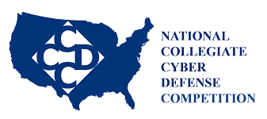

[CCDC](https://www.nationalccdc.org/index.php/competition/about-ccdc/mission) is a cyber defense competition that the Greyhats club at UH Manoa gives informational and hands-on training for.

Being in ICS 314, we are encouraged to use generative AI such as ChatGPT if we feel we would need their assistance throughout the class, but we have to report on several factors such as how we prompted the AI, how we determine if the answer(s) given back are correct, and if we feel that any code given is that effective or not.

I am looking to also analyze how many of my peers might be utilizing the tool of generative AI, and learn how to educate anyone on how one can use it as a proper resource, especially as it pertains to a computer science course like ICS 314- Software Engineering.
