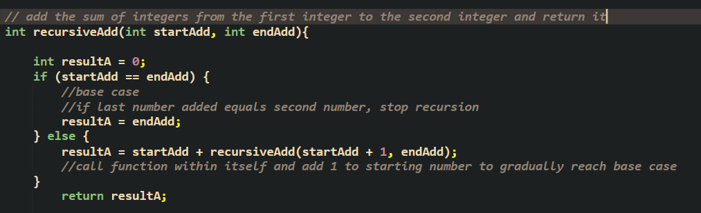

I was given an assignment to create recursive functions that performed basic math operations to better get the hang of recursion and how to implement it in C.  Before the assignment, recursion was a concept I had learned in the past but did not particularly like because of how I struggled to grasp the idea of it.After this assignment, which included multiple recursive functions to perform operations on numbers in between the range of two parameters, I grew to really enjoy recursion and the idea of it much more.  

Since then I have looked a lot more into the applications of recursion vs iteration, as well as the different reasons why it is powerful and important to understand. If a function is able to be implemented recursively, I ponder the different tradeoffs of recursion for the specific function.
