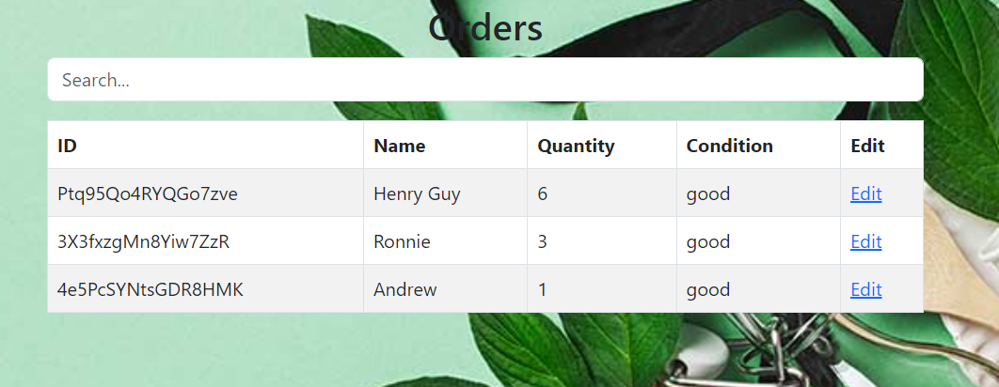

### Zero Waste

## Purpose
Zero Waste stemmed from a challenge from this year's HACC (Hawaii Annual Code Challenge) which sought a way to keep track of borrowed plastic containers for public events and make sure that they are returned to ensure no waste was being produced. Essentially the app was developed with an aim to keep track of the inventory of containers as well as how many were borrowed and who was borrowing them.  Different forms pages are used to keep track of this borrow and return process, and a QR code was added as a special feature to help with payment regarding what needed to be payed for in the process.

## Role
I was in charge of the checkout page, which had to take people's names, type of container, and how many were given out.  Additionally I had to make sure to link the forms to the different Mongo Databases so that we could figure out who are borrrowing how many containers, and how many there were in the first place to know if there are more that can be borrowed. On top of this I acted as the main facilitator of group meetings, trying to set up times for everyone to meet, giving documents with notes from our meetings, and trying to organize what should be done at a given point of time.

## Issues 
On top of actually figuring out the logistics of how a basic "borrow and return" system worked on a website, it was mostly hard to get communication and documentation of everyone's theoretical and working ideas throughout development.  Ultimately we got the basic things to work out, but it could have been improved to have the whole website feel more cohesive with each page responding well with the databases and each other.

