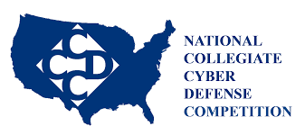

[CCDC](https://www.nationalccdc.org/index.php/competition/about-ccdc/mission) is a cyber defense competition that the Greyhats club at UH Manoa gives informational and hands-on training for.

Having much interest in the concepts of cyber security but little experience on the specific skills one should start learning when getting into it, I decided to attend the two training/informational sessions over this past Summer on CCDC that Greyhats offered. The sessions consisted of an overview of the rules, experiences, and what one might expect from a cyber defense competition.  

I was first able to learn more about VMs(Virtual Machines) as well as why they are used and how that is applied in the environment of CCDC as a competition.  Later on we touched briefly about other topics such as OSI models, basic security protocol when configuring a network, as well as how different security protocols and services might be different in different operating systems.  Currently, we are working toward teaching ourselves how to defend against different network attacks over different operating systems.  Overall, the experience very much excited me about what I should be learning before taking different security courses as well as the fun I might have experiencing how it is to defend a system with a team.  It was a great introduction to any sort of cyber security concepts I might run into.  I will definitely try to attend all the sessions, and I would just like to challenge myself and learn what I can through all the training.

